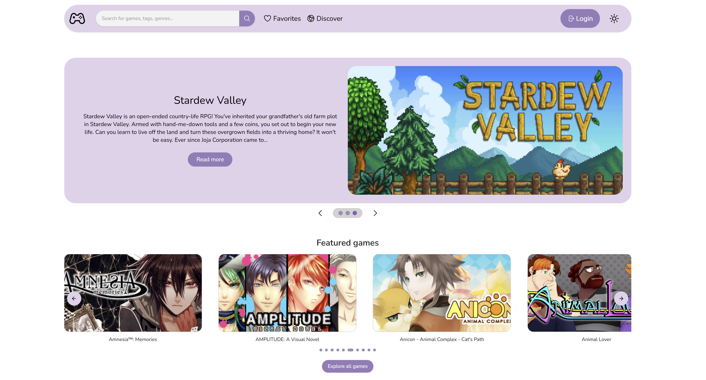

# Realm

Lenke til nettsiden vår: [Realm](http://it2810-01.idi.ntnu.no/project2)

**Innlevering 3 - Oppsummert:**
Alle kravene for projekt 2 er implementert. Samt gått gjennom tilbakemelding fra medstudentene fra innlevering 2 og videreutviklet tipsene vi fikk. For denne sprinten har vi hatt fokus på refaktorering og en mer smidig applikasjon. 

> [!IMPORTANT]
> For innlevering 3: Brukernavn og passord som dere kan bruke finner dere under [Innlogging](#innlogging). Denne seksjonen **Innlevering # - Oppsummert:** vil bli fjernet ved endelig levering, den 14.11.25

## Innholdsfortegnelse

- [Realm](#realm-1)
- [Utviklet av](#utviklet-av)
- [Projektstruktur](#projektstruktur)
- [Funksjonalitet](#funksjonalitet)
- [Designvalg](#designvalg)
- [Teknologier](#teknologier)
- [Testing](#testing)
- [Hvordan kjøre kode](#hvordan-kjøre-kode)
  - [Innlogging](#innlogging)
- [Hvordan teste](#hvordan-teste)
- [Diverse informasjon](#diverse-informasjon)

## Realm

Realm er ikke bare en nettside, det er en portal til spilluniverset! Her kan du oppdage og utforske de råeste spillene, og få enkel tilgang til både rangeringer og topplister.

Målet med Realm er å gjøre det superenkelt å finne neste spillopplevelse, enten du; vil prøve noe helt nytt, trenger litt inspirasjon, eller bare er nysgjerrig på hva alle andre gamer om dagen.

<em>Realm er din guide, din oppdager og din inngangsbillett til spillverdenen.</em>



## Utviklet av:

- Sylvia Suet Wai Yung, <sylvia.yung@ntnu.no>
- Jennica Duong, <jennica.duong@ntnu.no>
- Nicolay Emil Fremstad Løvlie, <nelovlie@stud.ntnu.no>
- Gustav Skrefsrud, <gustaskr@stud.ntnu.no>

## Projektstruktur

```
T01-Project-2/
├── .github/                         # GitHub-relaterte filer for samarbeid og CI
|   ├── workflows/                   # CI pipeline for backend og frontend byggetester og deploy
|   ├── CODEOWNERS                   # CODEOWNERS fil for PR  
|   └── Pull_request_template.md     # Standard mal for PR
├── backend/                         # Backend Express-applikasjon 
|   ├── prisma/                      # Databaselagring og ORM-konfigurasjon med Prisma 
|   |   ├── migrations/              # Genererte migrasjoner for databaseendringer
|   |   └── schema.prisma            # Databaseskjema og modell-definisjoner
|   ├── src/                   
|   |   ├── constants/               # Globale konstanter brukt i applikasjonen
|   |   ├── graphql/                 # GraphQL-skjema, resolvers og typer 
|   |   |   ├── filter/              # Filtreringsrelaterte resolvers og typer
|   |   |   ├── game/                # Game-relaterte resolvers, queries og mutations 
|   |   |   ├── review/              # Review-relaterte resolvers og datalogikk
|   |   |   ├── user/                # Brukerautentisering og brukerdatahåndtering
|   |   |   ├── baseTypeDefs.ts      # Grunnleggende GraphQL-typeDef som definerer tomme Query- og Mutation-typer
|   |   |   ├── context.ts           # Context-object som injiserer Prisma-klient og evt bruker-ID i hver request
|   |   |   └── index.ts             # Samler og merger alle GraphQL-typeDefs og resovlers til ett komplett API
|   |   ├── scripts/                 # Skript som importerer data fra JSON og fyller databasen lokalt eller på VM
|   |   ├── db.ts                    # Databaseklient og tilkoblingshåndtering
|   |   └── server.ts                # Oppstart og konfigurasjon av Express-server
|   ├── .env.template                # Template for .env fil 
|   ├── package.json             
|   └── README.md 
├── frontend/                        # Frontend React-applikasjon
|   ├── public/                      # Statiske fil som favicon
|   ├── src/
|   |   ├── assets/                  # Bilder, og andre mediefiler
|   |   ├── components/              # React-komponenter
|   |   |   ├── FeaturedSection/     # Seksjon for fremhevende spill
|   |   |   ├── Header/              # Hamburgermeny og Navigasjonsmeny 
|   |   |   ├── InformationCards/    # Kortkomponent som viser spill informasjon 
|   |   |   ├── ResultFilters/       # Filtreringskomponenter
|   |   |   ├── ResultsGrid/         # Grid-visning for spillresultater
|   |   |   ├── Reviews/             # Komponenter for brukeranmeldelser
|   |   |   ├── Skeletons/           # Lasteanimasjoner (loading states)
|   |   |   ├── ui/                  # Shadcn UI-elementer
|   |   |   └── User/                # Brukerrelaterte komponenter som login og profil 
|   |   ├── hooks/                   # Custom React-hooks for delte logikkfunksjoner
|   |   ├── lib/                     # Hjelpefunksjoner og konfigurasjon (utils, apolloClient)
|   |   |   └── graphql/             # Håndtering av GraphQL-spørringer og mutasjoner for kommunikasjon med backend 
|   |   ├── pages/                   # Sidekomponenter
|   |   ├── test/                    # Enhetstester og komponenttester
|   |   ├── types/                   # TypeScript-typer og interfaces
|   |   ├── App.tsx                  # Hovedkomponent for hele applikasjonen
|   |   ├── index.css                # Globale CSS-styling for typ font, og egen definert farger
|   |   └── main.tsx                 # Inngangspunkt for rendrer React-applikasjonen
|   ├── .env.development             # Miljøvariabler for lokal utvikling
|   ├── .env.production              # Miljøvariabler for produksjonsmiljø 
|   ├── package.json   
|   └── README.md
├── package.json
└── README.md
```


## Funksjonalitet
### Søkefunksjon
- 5 ulike søkemetoder: spill, sjanger, kategorier, publisher og tag-søk. 
- Returnerer 6 resultater, men også alt ved å trykke på "søk". 
- Debounce-funksjon - hente resultater hvert 200 millisekund. 
- URL-query paramter istedenfor lokal- eller sessionstorage. 
- Case-insensitiv søk.
- Les mer [her](#søk) for mer informasjon

### Listevisning av søkeresultater
- Søkeresultatene vises som en resultat av 6 spill.
- Ved å klikke på "søk" blir man tatt med videre til "discovery" siden.
- Bruker blir presentert 9 forskjellige spill.
- Brukeren kan bla og velge sidenummer - paginering. 

### Sortering og filtrering av resultater
- Bruker kan sortere på 8 ulike måter: 
  - Mest populær
  - Minst populær
  - Lanseringsdato eldst
  - Lanseringsdato nylig
  - A - Z
  - Z - A  
  - Høyest rating
  - Lavest rating
- Brukeren har 5 ulike filtreringsmetoder: 
  - Sjanger
  - Tags
  - Kategorier
  - Plattformer
  - De største forlagene 
- Filtrering og sortering blir en URL-query parameter
- Les mer [her](#filtering) for mer informasjon.

### Detaljvisning av objekter
- Bruker kan klikke på spill hvor hen blir presentert informasjon om spillet. 
- Brukere kan lese andre reviews, og klikke på en "read more" for flere reviews gjennom scrolling.

### Brukergenererte data 
- Bruker kan legge inn review på informasjonssiden om spillet.
- Bruker kan endre, og slette review. 
- Bruker kan legge inn ratings - stjerne. 
- Bruker kan favorisere spill, og dette blir lagret i en favorite page. 

### Persistent datalagring i database
- Lagring av brukergenererte data nevnt over
- Lagring av opprettede brukere 
  - Case-insensitiv brukernavn 
  - Unik brukernavn og epost 
  - Sikker innlogging med JWT tokens 

### Universell utforming / web accessibility
- ARIA-labels, tabing gjennom tastaturnavigasjon 
- Optimal kontrast i både dark og light mode. 
- Mobile og dekstop versjon tilgjengelig 
- Mer informasjon kan leses [her](#valg-knyttet-til-tilgjengelighet)

### Bærekraftig webdesign
- Debounced søk 
- Lazy loading 
- Effektiv henting av opptil 60 000 spill 
- Skeleton for loading
- Benytte av gratis font istedenfor importert 

## Designvalg

### Valg av data

Vi har valgt å bruke [Steam-data](https://github.com/leinstay/steamdb/blob/main/steamdb.json?fbclid=IwY2xjawNDjqZleHRuA2FlbQIxMQABHsCnZkZy_MaG1QZaY4JE-drjoaUiFSmVxhe9muo9Jg_aEjf3uDMQxz13Ov-S_aem_QnaD-SItGO9e7gRzCDddyw) som grunnlag for prosjektet vårt. Databasen inneholder et bredt spekter av variabler - alt fra bilder, titler og sjangre til pris og en rekke andre underfelter. Dette gir oss et solid utgangspunkt for å bygge mer komplekse komponenter. Målet er å hente inn denne dataen, lagre den i vår egen database og skreddesy den til vår behov. Siden Steam-dataen inneholder mange felter vi ikke har behov for, vil vi filtrere og tilpasse informasjonen slik at vi sitter igjen med akkurat det som er mest relevant for vår plattform.

### Valg knyttet til søk, filtrering, og sortering

#### Søk

Applikasjonen tilbyr fem ulike søkemetoder: spill, sjanger, kategori, publisher og tag-søk. Hver søkeoperasjon returnerer opptil seks resultater, men også alle resultater som stemmer ved å trykke på søk. Da vil du bli tatt med videre inn til disovery siden. For å forbedre ytelse og brukeropplevelse har vi implementert en debounce-funksjon som begrenser antall forespørsler ved å hente resultater hvert 200 millisekund.

Vi har lagt vekt på å gi brukeren stor fleksibilitet i søkefunksjonen. Dersom en bruker for eksempel søker etter “Portal”, vil applikasjonen returnere alle spill som inneholder dette ordet i tittel, tag, kategori eller sjanger. Søkeparametrene håndteres via URL-query parameters i stedet for lokal- eller sesjonslagring. Dette muliggjør at søk kan deles mellom brukere ved å kopiere og dele den gjeldende URL-en, som dermed reflekterer søkets nåværende tilstand.

#### Filtering

Filtreringsfunksjonaliteten er tilgjengelig på Discover-siden. Her er filtreringen implementert på backend, fremfor å skje lokalt i frontend. Dette valget gjør det mulig å filtrere basert på hele datasettet, og ikke kun på de elementene som allerede er lastet inn i klienten.

Vi har også valgt å definere en konstant `top publisher` som du kan finner [her](./backend/src/constants/topPublishers.ts). Dette valget ble gjort fordi databasen inneholder over 25 000 ulike publishers, noe som ville vært lite effektivt å hente ut i sin helhet. En slik prosess ville skapt unødvendig ressursbruk og dårligere brukeropplevelse. For å fremme ytelse, bærekraft og relevans, har vi derfor valgt å kun inkludere et utvalg av de mest kjente og populære publisherne på markedet per dags dato.

#### Sortering

På Discover-siden kan brukeren også sortere spill basert på ulike 8 ulike kriterier: minst populær, mest populær, lanseringsdato eldst, lanseringsdato nylig, A-Z, Z-A, høyest rating, og lavest rating. Sorteringen utføres på backend, slik at resultatet reflekterer hele datagrunnlaget fremfor kun de dataene som er tilgjengelige lokalt i applikasjonen. 

Nedenfor følger en kort forklaring på to av sorteringsalternativene:
- **Minst populær:** Viser spill som mangler rating og favorisering, sortert alfabetisk.
- **Lavest rating:** Filtrerer bort spill uten rating, slik at spill med lavest faktisk rating (f.eks. 1) vises først.
Ved å håndtere sortering på serversiden sikres både presisjon, konsistens og bedre ytelse, uavhengig av hvor mye data som er lastet inn hos brukeren.

#### Cursor Pagination 
For å håndtere store datamengder i listevisningen av søkeresultater, har vi implementert cursor pagination i backend. I stedet for å bruke tradisjonell sidebasert paginering med offset, hvor man henter resultater basert på sidetall, bruker vi en cursor som peker til det siste elementet i gjeldende resultatside. Dette gir flere fordeler: data hentes mer effektivt fra databasen, og listen forblir konsistent selv om nye spill blir lagt til eller fjernet mens brukeren blar. Cursoren sendes som en del av GraphQL-spørringen, og backend returnerer alltid neste sett med elementer basert på denne referansen. Dette gjør navigasjon gjennom søkeresultater raskere og mer pålitelig, samtidig som serverbelastningen reduseres.

### Valg knyttet til bærekraft
Vi har hatt fokus på bærekraft gjennom hele utviklingen, både i bildehåndtering, databruk og designvalg. Ettersom applikasjonen er visuelt basert, har bilder vært nødvendige, men vi har konvertert dem fra JPG til WebP og skalert dem ned ved henting for å redusere filstørrelse og forbedre ytelsen.

For å begrense unødvendig trafikk mot backend benytter vi debouncing i søkefunksjonen og effektiv datainnhenting for å unngå overflødige kall. Vi har også implementert caching av data for å redusere behovet for gjentatte forespørsler til serveren. Dette gjør at brukere får raskere opplevelser ved navigasjon og gjenbesøk, samtidig som det reduserer energibruken og belastningen på serverressurser. Ved å gjenbruke tidligere hentede data i stedet for å hente alt på nytt, bidrar vi både til bedre ytelse og lavere karbonavtrykk.

Vi har valgt en enkel fargepalett med støtte for dark- og light mode, samt bruk av innebygde fonter for å redusere ressursbruk.

### Valg knyttet til tilgjengelighet
Vi har hatt et sterkt fokus på tilgjengelighet i utviklingen av applikasjonen. Frontenden er bygget med Shadcn/UI, som benytter Radix UI Primitives som grunnlag. Dette rammeverket følger WAI-ARIA-retningslinjene og håndterer sentrale aspekter som tastaturnavigasjon, fokusstyring og støtte for skjermlesere. Dermed får vi et solid utgangspunkt der mange tilgjengelighetsfunksjoner er innebygd, samtidig som vi har full kontroll til å tilpasse og forbedre komponentene etter behov.

For å sikre best mulig brukeropplevelse har vi selv lagt til ARIA-attributter der det manglet, og justert fargekontraster for å bedre lesbarhet for brukere med fargesynshemninger. Vi har også implementert tabbing for effektiv tastaturnavigasjon. 

I tillegg har vi brukt Lighthouse i inspeksjonsmodus (Google Chrome DevTools) for å teste og forbedre tilgjengeligheten i løsningen. Dette har gjort det mulig å identifisere mangler og justere både struktur og kontraster for å møte kravene til universell utforming.

Selv om Shadcn/UI tilbyr et sterkt fundament for universell utforming, har vi vært bevisste på at sluttresultatet avhenger av utviklerens egen implementasjon, og har derfor gjort egne tiltak for å ivareta tilgjengeligheten fullt ut.

### Valg knyttet til global tilstandshåndtering
Vi bruker Apollo Client med InMemoryCache som hovedverktøy for global tilstand og caching av GraphQL-data. Cache-oppsettet er enkelt og bygger på standard normalisering. Vi bruker fetchPolicy og målrettet refetch i stedet for komplekse cache-modifikasjoner for å sikre konsistens og enkelhet.

UI-relatert tilstand håndteres lokalt i komponenter og hooks, mens URL brukes som “source of truth” for filtre og sortering slik at deling og navigasjon fungerer sømløst.

### Valg knyttet til gjenbrukbar kode

I prosjektet har vi hatt et sterkt fokus på å utvikle små og gjenbrukbare komponenter. Dette innebærer at vi bygger større komponenter ved å kombinere mindre og mer generelle byggeklosser. Et eksempel på dette er PromoCard og GameCardDetail, som begge benytter den felles komponenten GameCardBase. Denne tilnærmingen gjør koden enklere å vedlikeholde, gjenbruke og utvide.

Vi har bevisst unngått å legge omfattende logikk direkte i page-komponentene, og heller flyttet mest mulig funksjonalitet ned i gjenbrukbare komponenter og custom hooks. Noe logikk er likevel bevart på sidenivå, da det fungerer som et overordnet kontrollpunkt for datahåndtering og tilstandsstyring mellom flere underkomponenter. På denne måten blir sidekomponentene ansvarlige for å koordinere dataflyt og helhetlig struktur, mens de mindre komponentene fokuserer på spesifikke deler av brukergrensesnittet. Dette gir en ryddig arkitektur der ansvarsområder er tydelig fordelt, samtidig som koden er lett å lese og forstå for hele utviklingsteamet.

## Teknologier

### Frontend

- `React` og `TypeScript`
  - Vi bygger frontend med React kombinert med TypeScript. React gjør det enkelt å lage dynamiske og komponentbaserte grensesnitt, der alt kan gjenbrukes og oppdateres effektivt. TypeScript gir ekstra trygghet ved å sjekke typer under utvikling, noe som reduserer bugs og gjør koden mer pålitelig.
- `React Router`
  - For å håndtere flere "sider" i vår prosjekt, bruker vi React Router. Dette gir oss muligheten til å navigere sømløst mellom ulike deler av applikasjonen, samtidig som brukeropplevelsen blir rask og flytende.
- `Tailwind CSS`
  - Vi bruker Tailwind CSS til all styling. Tailwind gjør det raskt og intuitivt å designe komponenter og sider uten å skrive masse tilpasset CSS. Det gir også god støtte for ulike nettlesere rett ut av boksen.
- `HeroIcons` & `Lucide`
  - Ikoner henter vi fra HeroIcons og Lucide, som gir et stort utvalg moderne og stilrene ikoner. Disse kan enkelt brukes i komponentene våre, noe som gjør grensesnittet både mer visuelt appelerende og brukervennlig.
- `Shadcn`
  - Vi benytter oss av Shadcn/UI for å bygge moderne og tilgjengelige brukergrensesnitt basert på React og Tailwind CSS. Shadcn tilbyr et omfattende bibliotek av ferdige, men fleksible komponenter som enkelt kan tilpasses prosjektets designprofil. Dette bidrar til et mer konsistent og profesjonelt visuelt uttrykk, samtidig som utviklerstiden reduseres.
- `Apollo client` (GraphQL)
  - For kommunikasjon mellom frontend og backend benytter vi Apollo Client sammend med GraphQL. Apollo Client gjør det enkelt å hente, cache og oppdatere data på en effektiv måte, og bidrar til at applikasjonen forblir responsiv og konsistent.

### Backend

- `Apollo Server`
  - Vi bruker Apollo Server som en grunnmur for backend. Apollo gir oss et fleksibelt og moderne rammeverk for å bygge GraphQL APIer, og lar oss strukturere og hente data på en effektiv måte. Per nå kjører vi Apollo Server "standalone", noe som gjør oppsettet enkelre i denne fasen av prosjektet.
- `GraphQL`
  - GraphQL er språket vi bruker for kommunikasjon mellom klient og server. I stedet for å ha faste endepunkter som i REST, kan vi ha GraphQL spørringer slik at klienten kun henter akkurat den dataen den trenger. Dette gir mindre overføring, men kontroll og mer fleksibilitet i frontend.
- `Prisma + PostgreSQL`
  - Vi bruker Prisma sammen med PostgreSQL som database. PostgreSQL er en kraftig og stabil relasjonsdatabase som lagrer data på en strukturert måte og skalerer godt. Prisma fungerer som en type-sikkert lag mellom applikasjonen vår og databasen, slik at vi kan definere datamodeller og hente eller oppdatere data uten å skrive rå SQL.
  - Prisma genrerer en klient som vi kan bruke i backend-koden for å gjøre spørringer og oppdateringer mot PostgreSQL på en enkel og sikker måte.
- `dotenv`
  - Vi bruker dotenv for å håndtere miljøvariabler. Dette gjør at sensitive nøkler og instillinger kan lagres sikkert uten å legge dem direkte inn i koden.
- `JsonWebToken`
  - For autentisering bruker vi JSON Web Tokens (JWT). Når en bruker logger inn, genereres et signert token som senders til klienten og brukes ved videre forespørsler. Dette gir en enkel og sikker måte å håndtere innlogginsstatus og tilgangskontroll på. 
- `bcrypt`
  - Passord hashes ved hjelp av bcrypt før de lagres i databasen. Dette sørger for at passord aldri lagres i klartekst, og styrker sikkerheten mot datainnbrudd.

## Testing

**Cypress**
Kommer i sprint 4 

**Enhetstester**

Vi har lagd enhetstesting til alle komponentene våre for å verifisere funksjonalitene deres. På denne måten hjelper det oss med å identifisere bugs tidlig, forberede kodekvaliteten, og sikrer at endringene vi gjør ikke medfører til nye problemer.

Vi har testet reponsivitet gjennom manuelle tester via nettleserens sin inspiser modus.

## Hvordan kjøre kode

Dette prosjektet er splittet opp i to ulike undermapper, `frontend` og `backend`. De har sine individuelle packages som må kjøres fra deres respektive undermapper. Les gjennom README's til disse mappene for instruksjoner på hvordan man kan installere og kjøre hver av dem.

> [!NOTE]
> Miljøvariablene som trengs for å kjøre applikasjonen kan man finne i vår VM under `/home/jennicad/backend/.env`. Dersom du ønsker å kopiere dette for å bruke lokalt, må du legge de under .env filen i `backend` folder for at ting skal funke. Mer informasjon står i de respektive README filene.

- [Frontend Instruksjoner](./frontend/README.md)
- [Backend Instruksjoner](./backend/README.md)

### Innlogging 
Vi har full forståelse dersom man ikke ønsker å lage en bruker i vår database på vm! Derfor har vi laget en bruker som alle kan benytte seg av når de skal medstudentvurdere/sensurere vårt prosjekt. 

- **Brukernavn:** test
- **Passord:** Gruppe1

## Hvordan teste

### End to end tester
Kommer i Sprint 4

### Komponenttester

For å kjøre komponenttestene, pass på at du er i frontend mappen og kjør følgende kommando:

```bash
npm run test
```

## Diverse informasjon

- **Side som ikke svarer**
  - Dersom siden ser ut til å ikke være tilgjengelig, pass på at du er koblet til NTNU sine nettverker, enten gjennom eduroam eller ved å bruke NTNU VPN.
  - Et annet problem kan være at backend ikke kjøres. Dersom dette er tilfellet, les gjennom [README for backend](./backend/README.md).
- **Mangler miljøvariabler - env filer**
  - Pass på at du har korrekt .env variabler. Mer om dette står kan leses [her](#hvordan-kjøre-kode).
- **Auth0**
  - I Sprint 2 har vi implementert et innloggings- og profilsystem ved hjelp av tredjepartstjenesten Auth0. Valget av Auth0 ble gjort for å redusere kompleksiteten ved å utvikle et eget autentiseringssystem og for å dra nytte av en etablert løsning med innebygd sikkerhet og støtte for moderne autentiseringsprotokoller.
  - Det er imidlertid verdt å merke seg at Auth0 per nå kun fungerer i det lokale utviklingsmiljøet, og ikke på den distribuerte nettsiden. Under arbeidet med Sprint 2 (innlevering 18.10.25) oppdaget vi at Auth0 krever en sikker tilkobling (HTTPS) for å fungere korrekt, mens vår nettside for øyeblikket benytter HTTP. Dette har medført at autentiseringsløsningen ikke er tilgjengelig i produksjonsmiljøet.
  - Vi har valgt å fjerne Auth0 koden, og implementere vår egen Auth løsning. Sensitiv data som password vil bli hashed ved hjelp av bycrypt.
  - Auth0 koden er fortsatt tilgjengelig gjennom releases: `Innlevering2`
